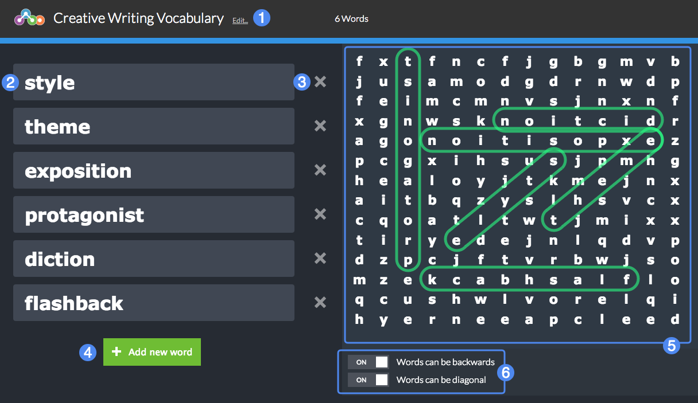

# Creator Guide #

## Overview ##

In Word Search, students must locate a series of terms within a grid of random letters. Terms can be arranged horizontally, vertically, or diagonally, based on the options you set.

1. Widget title
2. Term
3. Remove this term
4. Add a new term
5. Letter grid
6. Arrangement options

## Details ##

Add words or terms to the list on the left to begin generating the puzzle automatically. Note the scale of the puzzle automatically adjusts based on the length and complexity of the list of terms. For best results, ensure all terms are single words or very short phrases.

Select the optional toggles below the puzzle (6) to increase the difficulty of the puzzle: by default, words will only appear horizontally or vertically, and not backwards, unless the toggles are selected for those options.

Take care in the design of your widget: too many words, or terms with too many letters, will create an extremely large grid and increase the complexity of the widget dramatically. Practice the puzzle yourself using the "preview" option to ensure the puzzle can be completed in a reasonable amount of time.