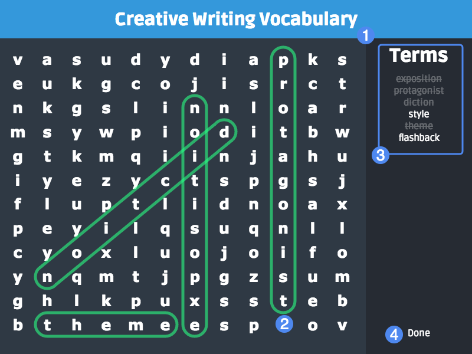

# Player Guide #

## Overview ##

In Word Search, students must locate a series of terms within a grid of randomly assorted letters. Words can be arranged horizontally, vertically, and potentially diagonally and backwards as well.

1. Widget title
2. Identified word
3. List of terms
4. Submit button

## Details ##

Review the list of terms on the right and begin searching the letter grid for each. When you identify a word or phrase from the list, click and drag from the first letter to the last letter to identify it. If the term was successfully identified, it will be crossed out from the list on the right.

When you've completed selecting all terms from the list, click the "Done" button on the bottom-right to complete the widget and receive a score.